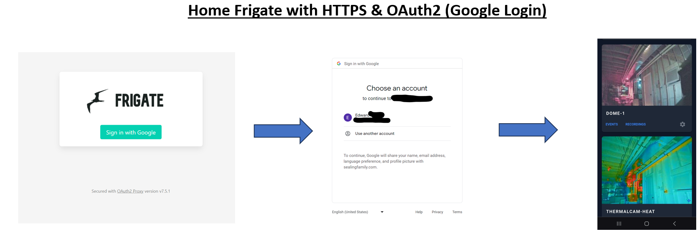
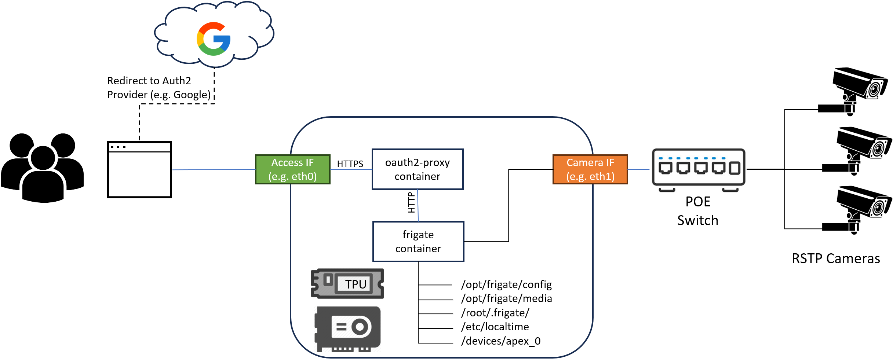

# Overview
This Ansible code automates the deployment of a frigate server on VM or Bare Metal, with optional OAuth2 & HTTPS support.



Includes roles and variables to support optional configurations:

| Configuration | Details                  |
| ------------- | -------                  |
| Coral.AI PCI device     | Installs drivers for the [Coral M.2](https://coral.ai/products/#production-products) PCI device. Passes into container |
| Nvidia GPU (encoding/decoding)| Installs drivers, CUDA, and container-toolkit. Configures container to support GPU decoding |
| Google OAuth2 Login | Installs [oauth2-proxy](https://github.com/oauth2-proxy/oauth2-proxy) for SSL termination and configures OAuth2. Rather than setting up a home auth system, just use "Login with Google". ¯\\_(ツ)_/¯ Can specify which email addresses should be allowed to access the service |
| Isolated Camera Network | Configures optional interface that segregates the camera network from the internet-accessible network for additional security | 

**NOTE:** Not every configuration combination has been tested. Tested using Ubuntu 22.04.3 Server (no graphical interface). I've tried to account for a lot of different situations, but your results may vary. Feel free to submit an Issue or Pull Request if you find something that doesn't work.

ToDo List:
- Create variable for camera video encoding (currently defaulted to H.265)
- ~~Separate the Nvidia container-toolkit from CUDA package list.~~ DONE!
- Allow use of own certificates for HTTPS
- ~~Refactor ansible variable precedence to be clear how to override variables~~ DONE!
- Test on Ubuntu Desktop and a few different versions
- Ensure all scripts are idempotent and can be run multiple times (currently not idempotent due to docker-compose-excerpt.yml.j2 process)

## Quickstart Installation

Ansible should be run from a separate linux or WSL host that has passwordless ssh and passwordless sudo access to the Ubuntu server. For instructions on setting up the host, installing ansible, setting up SSH/password-less sudo  see "Setup_Details.md".

There is an example [config.yml template](ansible_main/roles/frigate-container/templates/config.yml.j2) that can be modified. It automatically configures the Coral AI and Nvidia GPU requirements, however if you already know what your end-state config will be, you can just replace the contents of this file with your config and it will copy it to the correct location (/opt/frigate/config/config.yml). Or you can keep the defaults and modify it in the webUI.

### Clone the repo and install requirements
```bash
git clone https://github.com/drikster80/ansible-frigate-standalone.git

cd ansible-main
ansible-galaxy install -r requirements.yml
```
### Set initial variables

Open the inventories/frigate.yml and set the following variables:
```yaml
      ansible_host: '<INSERT IP OF TARGET>'    # IP of new target server
      ansible_user: 'frigate'                  # Username for the target server with passwordless ssh & sudo
```
Next, update the config in the `server_config.yml` for your needs. Below are the minimum variables that should be set.

| Variable | Description | Value Types | default | Notes |
|--------- | ---- | ----------- | -------- | -------- |
| `ansible_host`   | Target frigate system | IP address or hostname (String)      |  None   | |
| `ansible_user`   | Username to of target system| Username (String)      | frigate    | Also sets `docker_users` and `coral_ai_drivers_user` |
| `access_interface`   | Interface used for webserver|  String | ens33    | Sets interface to Firewalld 'public' zone & opens correct ports depending on oauth2 usage|
| `camera_network_interface`   | Interface used for camera network | String      | eno4np2    | Sets interface to Firewalld 'dmz' zone & closes all inbound ports|
| `camera_rtsp_user`   | Username of camera(s)| username      | admin    |  |
| `camera_rtsp_password`   | Password of camera(s) | username      | ChangeMeNow!    |  |
| `nvidia_gpu_present`   | Is a GPU used for encoding/decoding|  Boolean | false    |  |
| `coral_pci_present`   | Is a Coral.AI PCI device used| Boolean      | false    | |
| `oauth2_enable`   | Enable Google OAuth2 login proxy & HTTPS| Boolean      | false    | Requires some of Google API Credentials (free for gmail accounts) |
| `frigate_fqdn`   | Fully-Qualified Domain Name of frigate system | hostname (string)      | server.example.com    | Only required if oauth2_proxy is enabled |


### Execute the scripts

```bash
ansible-playbook -i inventories/frigate.yml frigate.yml
```

## General system architecture

In all deplyoments, Ansible will install docker, pull the specified frigate container, assign the interfaces to specific firewalld zones, and create a `docker-compose.yml` file. The diagram below depicts an example setup with the Google login (oauth2) and an isolated camera network.



Two directories are setup on the host during installation:

- **/opt/frigate:** Stores the frigate config and media locations (can be set differently in variables)
- **/root/.frigate:** Stores the sensitive items such as UN/PW of cameras, SSL private key, & authorized gmail addresses

## Nvidia GPU Configuration details

My setup uses the Nvidia T400 GB, but it *should* work for any Nvidia GPU. 

### Nvidia Role Variables

Utilizes [Nvidia's own Ansible Role](https://github.com/NVIDIA/ansible-role-nvidia-driver) to perform installation of the driver. Additional variables can be set. See the role details for more information.

NOTE: Some cards are restricted on the number of concurrent Encoder streams. This installation will optionally download and patch the Nvidia drivers with the [Keylase Nvidia Patch](https://github.com/keylase/nvidia-patch) to unlock additional streams. To see whether your card is limited, see the [Nvidia Encode and Decode GPU Matrix](https://developer.nvidia.com/video-encode-and-decode-gpu-support-matrix-new#Encoder).

By default, the installation effectively uses all GPUs available. This can be changed in the [docker-compose-exerpt.yml.j2](ansible-main/roles/frigate-container/docker-compose-excerpt.yml.j2) template if needed. Update the following section as needed.

```jinja

    deploy:
      resources:
        reservations:
          devices:
            - driver: nvidia
              capabilities: [gpu]

```

### Nvidia GPU Variables

| Variable | Description | Value Types | default | Notes |
|--------- | ---- | ----------- | -------- | -------- |
| `nvidia_driver_branch` | Version of Nvidia Driver to use | String | "535" | only tested 535 |
| `patch_driver_nvenc` | Whether to patch the driver for unlimted encode/decode streams | Boolean | true | Uses the [Keylase patch](https://github.com/keylase/nvidia-patch). Not necessary for all cards/ |
| `nvidia_driver_ubuntu_install_from_cuda_repo` | Whether to install from the Nvidia cuda repo | Boolean | true |  |
| `nvidia_driver_ubuntu_cuda_keyring_package` | Package to use for repo | String | "cuda-keyring_1.1-1_all.deb" | The Nvidia ansible code is older and uses an older version. Upgraded to latest here. |
| `nvidia_driver_skip_reboot` | Whether to reboot after driver install | Boolean | false | The playbook already reboots after all drivers are installed |
| `install_cuda_packages` | Whether to install additinoal CUDA packages | Boolean | true | These aren't technically ncessary if just encoding/decoding, but I normally install them anyway for other services. If you are using the GPU as a detector, then you need them. |
| `additional_nvidia_packages` | List of additional Nvidia packages to install | List of strings | <ul><li>cuda-toolkit</li><li>libcudnn8</li><li>nvidia-gds</li><li>nvidia-container-toolkit</li></ul> | |


## Coral AI Configuration details

If the `coral_pci_present: true`, the scripts will download and install the [Coral AI Driver Packages](https://coral.ai/software/#debian-packages) in accordance to the install instructions.

The Coral AI device is also set in the following config files:

- [config.yml.j2](ansible-main/roles/frigate-container/templates/config.yml.j2)
- [docker-compose-excerpt.yml.j2](ansible-main/roles/frigate-container/templates/docker-compose-excerpt.yml.j2)


### Coral AI Variables

| Variable | Description | Value Types | default | Notes |
|--------- | ---- | ----------- | -------- | -------- |
| `coral_ai_drivers_user` | Username of device | String | {{ansible_user }} | Not needed since Docker is run as root but keeping for future use |

## OAuth2 Configuration details

If the `oauth2_enable: true`, the scripts will utilize [OAuth2 Proxy](https://github.com/oauth2-proxy/oauth2-proxy) for both the Authentication and HTTPS (TLS) termination. OAuth2-Proxy can use a bunch of different providers. By default, we setup Google (e.g. Gmail). But more [providers are available](https://oauth2-proxy.github.io/oauth2-proxy/docs/configuration/oauth_provider) such as Microsoft, Facebook, etc. At this time, these scripts only handle Google. If you implement another, please consider contibuting it back through a PR.

**Requirements:**
- A Fully-Qualified Domain Name for your server (can use override your local DNS/Router or hosts file if you don't have a public domain)
- [Google Client ID](https://developers.google.com/identity/gsi/web/guides/get-google-api-clientid)
- Google Client Secret (provided with the Client ID)

The ansible scripts will automatically generate a 32-byte "cookie secret" for you, but you can also provide your own in the `cookie_secret` variable if you'd like.

### TLS Certificates

During the installation, the ansible scripts generate a Self-Signed CA certificate as well as a server certificate. These are placed in the following locations and be overwritten after installation.

- **CA private Key:** /etc/ssl/private/frigate_ca_privatekey.pem
- **CA public cert:** /etc/ssl/certs/frigate_ca_cert.pem
- **Frgiate private Key:** /root/.frigate/.frigate_privatekey.pem
- **Frigate public cert:** /opt/frigate/certs/frigate_cert.pem'

### Setting up the Google API Credentials

Google provides anyone with a Gmail account access to create "credentials" that an app can use for login. As far as I can tell, this is completely free.

For more details, checkout the [oauth2-proxy docs for the Google setup](https://github.com/oauth2-proxy/oauth2-proxy/blob/master/docs/docs/configuration/providers/google.md) for more information, but here is the basics from their docs:

1.  Create a new project: https://console.developers.google.com/project
2.  Choose the new project from the top right project dropdown (only if another project is selected)
3.  In the project Dashboard center pane, choose **"APIs & Services"**
4.  In the left Nav pane, choose **"Credentials"**
5.  In the center pane, choose **"OAuth consent screen"** tab. Fill in **"Product name shown to users"** and hit save. 

**NOTE:** If this is the first time, Google requires the app setup to be in "Testing" and must be set to "Make Internal". Everything still works. You don't need to set any "Test Users" since we are only requesting the email address and setting that in [/root/.frigate/.auth_emails.txt](/ansible-main/roles/oauth2-proxy/templates/.auth-emails.txt.j2)

6.  In the center pane, choose **"Credentials"** tab.
    - Open the **"New credentials"** drop down
    - Choose **"OAuth client ID"**
    - Choose **"Web application"**
    - Application name is freeform, choose something appropriate
    - Authorized JavaScript origins is your domain ex: `https://example.server.com` (FQDN that you set)
    - Authorized redirect URIs is the location of oauth2/callback ex: `https://example.server.com/oauth2/callback`
    - Choose **"Create"**
7.  Open `server_config.yml` and Update the variables `oauth2_proxy_client_id` with **Client ID** and `oauth2_proxy_secret` with the **Client Secret**.
8. Add the emails you would like to authorize to the `authorized_emails` variable as a list. By default, all are blocked.

It's recommended to refresh sessions on a short interval (1h) with `cookie-refresh` setting which validates that the 
account is still authorized.
